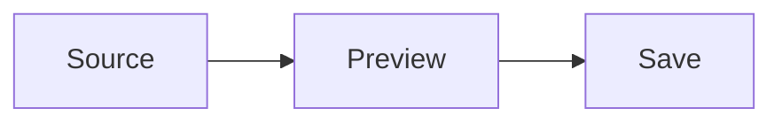

# Markdown Live Preview

Live edit target

**Bold with *nested emphasis***, ~~strikethrough~~ and `inline code`.

Escaped \*literal stars\* and [OpenAI](https://openai.com).

> A quote stays formatted while editing.

- [ ] Editable task
- [x] Completed task

| Feature | Status |
| --- | --- |
| **Live editing** | Ready |
| Source toggle | Same document |

```ts
const message = '**this stays literal**';
console.log(message);
```

Inline math $x^2 + y^2$ and a display equation:

$$
E = mc^2
$$




---
