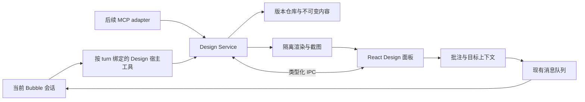

# Bubble Desktop Design 工具方案

日期：2026-09-29。状态：待评审的实施方案；尚未实现、打包或安装。

## 1. 产品决策

在聊天右侧加入持久化 Design 工作区，优先用于网页 / App 的多画板设计稿。用户提出需求，Agent 逐张生成画板；用户在画布上选择目标、写批注，再由同一聊天继续修改。

第一版采用 **HTML/CSS 画板 + 固定画布外壳 + 本地 Design Service + Bubble 宿主工具**。服务预留 MCP 适配层。设计稿由当前聊天 Agent 操作，专用 editor worker 放到后续阶段。

默认范围尚未收到用户进一步偏好；若优先海报自由排版，需重新评估文档模型，不能把本方案中的 HTML DOM 当成通用矢量节点树。

### 第一版承诺的体验

- 从对话创建多个独立设计文档；自动打开右侧 `Design · 文档名` 标签。
- 无限平移、缩放、适合窗口；画板重命名、移动、调整画板尺寸、复制、删除。
- 每张画板有生成进度，完整提交一张就显示一张；修改时保留上一版，成功后替换。
- 选择画板内元素或区域，附上批注和截图，发送回当前关联聊天。
- 展示画板版本，查看以前的版本，恢复为一个新版本。
- 关闭面板、切换聊天、重启应用后可恢复文档、批注和视角。
- 导出 HTML 资源包、画板 PNG；导出前标明哪些画板仍在生成或渲染失败。

第一版的人手编辑限于画板位置、名称和尺寸；HTML 内容通过 Agent 修改。文字双击编辑、属性面板、任意元素拖拽属于后续明确的功能阶段，不把“可选择元素”描述成完整可视化编辑器。

## 2. 当前代码基础与接入限制

以下为本次读取工作区源码的结果，不代表已验证安装版本。

| 已有能力 | 代码位置 | 用法 |
|---|---|---|
| 按聊天保存右侧面板状态 | `desktop/src/ui/utils/session-right-panel.ts`、`right-utility-tabs.ts`、`ui/types.ts`、`ui/App.tsx` | 增加 `design:<documentId>`，补齐持久化、恢复、全屏和标签分发 |
| 浏览器元素选择与批注 | `desktop/src/shared/design-mode-types.ts`、`electron/design-mode-service.ts`、`ui/components/browser/design-annotate.ts` | 复用选择信息、截图裁切和批注文案的纯函数；新画布单独实现消息桥 |
| 本地会话与 artifact 索引 | `desktop/src/electron/libs/session-store.ts` | 现有 artifacts 是文件关联表，不足以承担设计版本、批注、运行记录 |
| Bubble 的会话运行、排队和停止 | `desktop/src/electron/libs/provider/bubble-sdk-adapter.ts`、`libs/agent-loop.ts`、`src/sdk/index.ts` | 复用同一会话执行入口，保留停止、重试和输入持久化语义 |
| 原生工具接入先例 | `desktop/src/electron/libs/bubble-session-reader.ts` | 当前通过包装 SDK 私有 `mcpToolsFor` 接入；新功能应增加正式宿主工具接口 |
| 本机 MCP 服务先例 | `desktop/src/electron/libs/session-http-server.ts`、`session-mcp.ts` | 参考临时 loopback 服务和运行时注入；新服务必须增加文档/会话作用域 |

当前桌面只注册 Bubble。其他 provider adapter 属于保留代码，不能作为本期多运行时交付承诺。Bubble 不同模型提供商通过同一工具协议使用 Design。

当前 SDK 是进程共享实例。不能在它上面挂可变的“当前设计文档”或“当前 UI 会话”；这些必须绑定到每次 turn 的宿主上下文。

现有浏览器 Design Mode 明确采用“只收集意图、Agent 写用户源码”的策略。新 Design 工作区编辑的是应用管理的设计文档，两者使用不同服务、存储和入口。新方案不需要恢复已经删除的源码自动写回引擎。

## 3. 用户流程与界面

```text
┌──────────────────────┬─────────────────────────────────────────┐
│ 聊天                  │ Design · 订阅产品       历史  导出  全屏 │
│                      ├─────────────────────────────────────────┤
│ 帮我做首页和定价页     │ 选择  手形  批注  预览       75%  适合 │
│                      │                                         │
│ 正在生成 2 张画板      │  首页                   定价页          │
│                      │ ┌────────────────┐    ┌─────────────┐   │
│ [设计稿 · 打开]       │ │ HTML 设计稿     │    │ 正在生成…    │   │
│                      │ │              ① │    │             │   │
│                      │ └────────────────┘    └─────────────┘   │
│                      │                                         │
├──────────────────────┤ 批注 ①：标题再紧凑一点  [发送给 Agent]  │
│ 标题再紧凑一点         │                                         │
│ [首页 · 标题 ×]  发送 │                                         │
└──────────────────────┴─────────────────────────────────────────┘
```

1. 用户要求设计稿，或从工具入口选择 Design。Agent 调用创建工具，服务立即登记文档和计划画板，UI 显示占位。
2. 每张完整 HTML 通过校验后独立提交；UI 从服务事件更新，聊天里的 artifact 卡片指向稳定 documentId。
3. 点击元素进入批注。选择信息以可移除的上下文卡片进入输入框；普通批注保存后不自动运行 Agent。
4. 点击发送产生一次持久化请求。会话空闲时执行；正在运行时进入现有队列，第一版不把视觉修改默默插入正在执行的 turn。
5. Agent 读取最新画板及选中目标，修改，生成新版本并渲染检查。批注显示“已处理到版本 N，待确认”；用户确认才变成“已解决”。
6. 从历史聊天重新打开设计稿，不依赖旧工具日志里的 HTML 全文。

同一聊天有多个文档时，输入框的目标卡片明确指向文档/画板。没有选中目标且存在歧义时，由用户选择；不能把当前打开的全局标签当成 Agent 写入目标。

自动展开仅发生在用户当前前台聊天首次创建/主动打开时。后台聊天产生新画板只更新它自己的索引和状态，不抢焦点。

## 4. 架构与边界



- **Design Service**：身份与文档作用域校验、版本提交、批注、运行状态、导出和事件；唯一的应用内设计写入口。
- **Design Repository**：纯 Node/SQLite 模块，便于不启动 Electron 就测试事务、冲突、恢复。
- **DesignPanel**：React DOM 外壳，管理坐标系、缩放、画板容器和批注层。第一版不引入完整矢量编辑引擎。
- **DesignRenderHost**：在独立 Electron WebContentsView 中加载固定的展示页面，其中用隔离 iframe 渲染画板。工具栏与正文有固定边界；浮动批注与画板叠层由展示页面统一绘制，避免原生 View 覆盖 React 弹层。
- **DesignToolAdapter**：只是协议适配。原生调用、IPC、未来 MCP 都调用同一组 service commands，避免实现三套存储和版本规则。

第一阶段先做小型技术验证：多 iframe 在 Electron 中的选取、缩放坐标、截图、焦点及面板隐藏。如果多画板原生视图造成不可接受的布局问题，再比较隔离 web renderer 的替代方案；不直接复用浏览器的已登录 session partition。

### 为什么先用 HTML

| 方案 | 当前目标的适配度 | 决策 |
|---|---|---|
| HTML/CSS + 多画板外壳 | 模型生成成熟，可用浏览器还原排版，容易导出网页 | 第一版 |
| tldraw / Excalidraw | 白板、手绘、图形自由排列方便；高保真网页仍需自定义 HTML 嵌入 | 用户优先自由白板时再评估 |
| CanvasKit / 完整节点树编辑器 | 更适合精细矢量编辑，需要文本布局、命中、字体、撤销和导出体系 | 后续单独路线 |

HTML 外壳只承担画板级变换；画板内部响应式布局交给 CSS。不要把内部所有元素换成绝对坐标来实现拖动。

## 5. 文档与存储

默认存放在当前 Electron userData 下的 `designs/`，分别遵循生产、开发、QA 的数据隔离。无项目聊天也能创建。导出到项目目录是独立操作，不默认往 Git 仓库写临时文件。

```text
<userData>/designs/
  design.db                 # 权威索引、版本、批注、运行和幂等记录
  objects/<sha256>          # 不可变 HTML/CSS/图片/字体内容
  thumbnails/<renderKey>    # 可重建缩略图
  staging/<runId>/          # 尚未提交的内容，可回收
```

`canvas.json + boards/<boardId>.html + assets/` 是导出/检出的表现格式；不要让磁盘 manifest 和 SQLite 同时成为可独立修改的权威来源。普通写文件工具写了一个 HTML，不会自动升级成已提交设计版本。

核心实体：

```ts
DesignDocument {
  id, title, projectId?: string, ownerSessionId,
  schemaVersion, headRevision, createdAt, updatedAt
}
DesignBoard {
  id, documentId, name,
  x, y, width, height, placementRevision,
  contentHash, contentRevision
}
DesignRevision {
  documentId, revision, parentRevision, snapshot,
  author: 'user' | 'agent', runId?, operationId, createdAt
}
DesignRequest {
  id, documentId, sessionId, turnId?, requestEpoch,
  targets, commentIds, status, admittedAt
}
DesignComment {
  id, documentId, boardId, basedOnContentRevision,
  anchor, text, status, requestId?, appliedRevision?
}
```

内容版本与画板位置版本分开：用户拖动画板时不应使 Agent 的 HTML 修改无谓冲突。修改画板尺寸会影响渲染，截图标识包含内容、尺寸、素材与设计 token 的哈希。

素材和公共样式按不可变哈希关联。更新公共设计 token 生成新文档版本，原版本仍能用原素材重现。第一版不让 Agent 直接覆盖所有历史版本引用的同一个 CSS 文件。

### 原子提交与恢复

1. 校验调用作用域、run epoch、输入与预期版本。
2. 写入并持久化不可变内容对象；此时 UI 仍显示旧版本。
3. 在数据库事务里再次校验 epoch 和预期版本，插入 revision、更新 head、记录 operation receipt。
4. 事务成功才发事件；失败不会暴露半写入文档。孤立对象可以延后回收。
5. 崩溃发生在提交后、通知前，重启从数据库恢复。重复请求用 operationId 返回原回执，不再新增画板。

历史恢复是一笔新提交，不移动或删除历史记录。第一版支持文档级恢复和单画板内容恢复，均检查当前 head，界面说明恢复范围。后续直接文本编辑再增加动作级撤销栈。

## 6. Agent 工具协议

产品入口叫 Design，协议采用少量明确工具。单个巨大的 `design({operation, arguments})` 不利于当前 SDK 静态区分只读、计划模式和写权限。

| 工具 | 输入要点 | 输出/职责 |
|---|---|---|
| `design_create` | title、brief、可选画板规格、operationId | 建文档、登记到聊天、返回 documentId 和作者指南 |
| `design_read` | documentId、可选 boardIds/include | 目录、内容版本、目标 HTML、相关批注；默认不读所有画板全文 |
| `design_update` | documentId、operationId、typed operations | 创建/修改画板、移动、重命名、复制、删除；整批事务提交 |
| `design_preview` | documentId、boardIds、revision | 渲染状态、诊断、截图资产引用和对应版本 |
| `design_comments` | documentId、可选状态/cursor | 只读反馈列表及稳定锚点 |
| `design_export` | documentId、revision、boardIds、format | 创建导出资产，返回可保存的 HTML 包或 PNG |

V1 不提供任意 Node/JS 执行工具，不复制 AppifactRepl 的宿主代码执行能力。Agent 生成 HTML/CSS 作为数据提交即可。开始时只支持声明式 HTML/CSS、内联 SVG、本地素材；交互演示使用受控导航，不运行任意生成脚本。

示例更新协议（拟定接口）：

```json
{
  "documentId": "des_...",
  "operationId": "op_...",
  "operations": [{
    "type": "replace_board_content",
    "boardId": "brd_home",
    "expectedContentRevision": 4,
    "html": "<main data-bubble-node-id=\"home-root\">...</main>"
  }]
}
```

结果区分：`committedRevision`（已保存）、`renderStatus`（pending/ready/failed）、`renderedRevision`（截图对应的实际版本）。保存成功后截图失败，重试 preview，不重做写入。

冲突返回 `REVISION_CONFLICT`、当前版本和冲突画板；Agent 重新读取目标再提交。不要静默强制覆盖。operationId 重试输入相同返回原结果，输入不同返回 `IDEMPOTENCY_KEY_REUSED`。

只读工具为 read/preview/comments；create/update/export 有副作用，遵循现有权限与 plan-mode 策略。导出先生成应用管理的资产，保存到用户指定目录走既有文件授权流程，不在模型参数里开放任意写路径。

### 正式 SDK 接入

为 `RunTurnOptions` 增加拟定的 `hostTools` / host tool factory 扩展点，先声明为 additive API，具体命名在实施时统一。每 turn 创建不可变闭包，绑定 desktop sessionId、provider sessionId、requestEpoch、AbortSignal 和文档授权范围。

工具必须进入现有目录、prompt、计划模式、approval 和工具结果记录流程；不把具备写权限的工具全部标成 readOnly。是否允许子 Agent 继承由明确的 capability 决定，V1 默认不继承 Design 写权限。

`ToolContext.sessionID` 是 SDK 身份，不能假定等于 Desktop 会话 ID。建立显式映射，并在启动异步工作前固定身份。共享 SDK 实例不缓存带会话凭据的工具集合。

当前 `ToolResult.content` 为字符串，preview 返回一个 PNG 路径并不等于模型看到了图片。P0 必须验证/补齐图像 tool-result 传递：拟增加有大小限制的标准 image content，贯通 Agent 历史、模型适配和桌面记录。若模型不支持视觉，明确显示“完成渲染检查，未进行模型视觉检查”。不把 base64 塞进普通文本字段。

MCP 是第二种适配方式：loopback 临时端口、会话/运行作用域 token、相同 schema 和 service command。token 由宿主下发，不由模型选择 sessionId 授权；不写入用户全局 MCP 配置。初版 Bubble 原生入口无需经网络绕回自身。

## 7. 对话上下文与反馈

当前 Agent 已持有聊天上下文，创建时只落一份简明设计 brief（用途、目标用户、风格、画板清单、约束和素材）。文档不复制全部聊天历史。

每次关联设计稿的 turn，由宿主提供有限上下文：documentId、brief、画板目录、版本、当前目标及相关未处理反馈。Agent 用 read 按需获取 HTML。会话压缩/恢复后，通过持久化关联找回文档，而非依赖旧消息仍留在模型上下文。

批注上下文包示例：

```ts
{
  documentId, boardId, basedOnContentRevision,
  anchor: {
    nodeId?: string, textQuote?: string,
    rectNormalized?: { x: number, y: number, w: number, h: number },
    viewport: { width: number, height: number }
  },
  userText, screenshotAssetId?: string
}
```

要求生成器为重要元素保留稳定 `data-bubble-node-id`。服务检查重复 ID；修改时尽量保留已有 ID。锚点失效先尝试唯一的 ID/文本匹配，不能可靠定位时显示“原元素已变化”，保留原截图和文字，不悄悄定位到相似按钮。

DOM/CSS/用户批注都是待处理内容，不作为宿主系统指令。iframe 传回的信息只用于选取和预览；它不能直接发起写文件、运行工具或代表用户发送聊天。

### 排队、停止和迟到结果

- 批注发送前先持久化 requestId、文本和截图引用；附件准备过程中取消也能恢复原输入。
- 请求进入现有会话队列，由相同 requestId 去重。普通保存批注不会触发执行。
- 每个执行 turn 持有 requestEpoch；停止/替换运行时递增 epoch。每次异步等待后和提交事务内检查 epoch + AbortSignal。
- 停止前已经提交的画板保留，并标为本次部分结果；停止后迟到的生成/截图不再写入新状态，也不触发自动弹窗。
- 切换聊天只改变展示订阅，不等于取消后台执行；后台事件始终带 sessionId/documentId/runId/revision。
- SDK 停止与新请求启动沿用现有 stopAndWait/pendingSessionStops 顺序，不另起一套 turn 调度器。

会话复制/分叉时默认复制设计文档的 head 为新文档，底层可共享不可变对象；会话删除将关联文档移入可恢复状态，不依赖现有 artifacts 的级联删除销毁唯一设计。

## 8. 渲染和编辑边界

生成的 HTML 不进入主 UI 的 innerHTML。渲染使用独立无登录态 partition，关闭 Node，启用 contextIsolation/sandbox；不暴露通用 preload API，不继承普通浏览器的 Cookie。

iframe 使用受限 sandbox；V1 只加载宿主注入的 inspector 脚本，生成内容里的脚本、事件属性、iframe、表单提交和任意外链默认拒绝。资源通过只读的 doc-scoped URL 加载，CSP 限制网络、导航和下载。postMessage 以已登记 frame 的 source 和文档/画板实例 nonce 关联；opaque origin 下不能只检查 origin。

字体首期提供少量随应用管理的字体选项和 CSS tokens；素材由宿主导入并保存哈希。保持画布、截图、导出字体一致，不承诺直接使用 Claude 的专有字体。

缩放后的选区统一转换成画板 CSS 坐标再归一化，截图另处理设备像素比。只为可见及选中的画板保持实时 iframe，离屏用缩略图；更新只重载发生变化的画板。

预览检查包括：HTML/资源合法性、截图是否生成、字体/图片是否加载、明显溢出、控制台和资源错误。视觉好坏还需模型或用户检查。页面报 ready 不是全部检查成功的证据。

V1.1 再加纯文字节点编辑、受限颜色/间距属性。这些变化也提交给同一个 Service，带预期 contentRevision，更新 HTML 权威内容；不留下仅存在于 iframe DOM 的不可恢复编辑。任意布局拖拽不包含在这个阶段。

## 9. 旧 Coworker 尝试如何利用

已重新读取旧工作树 `/Users/chengshengdeng/.qoder/worktree/coworker/s6FdaH` 中的 `design-screens-service.ts`、`design-screen-storage.ts` 和 `design-html-tool-transport.ts`。

适合复用设计与测试思路：ScreenRepository、内容与 placement 分开版本、operation receipt 幂等、不可变内容与提交指针、HTML 工具严格 schema。

不能直接搬入整套：旧实现同时耦合 Aegis 的项目路径、Design Run、多种运行时、vector 引擎和 MCP gateway。按模块审查授权、依赖和测试后再选择性迁移。这里只做源码参照，未验证旧分支运行状态，也未合并代码。

## 10. 实施拆分与验收

阶段按可验收结果划分，不用未经验证的人天承诺。

| 阶段 | 交付 | 必须通过的验收 |
|---|---|---|
| P0 技术闭环 | 正式宿主工具扩展点、隔离渲染 spike、一张持久化 HTML 画板、模型可见截图 | 当前 Bubble 会话真实调用 create/update/preview；截图对应正确版本；停止后无迟到提交 |
| P1 多画板工作区 | `design:<id>` 面板、缩放/移动/尺寸、逐张发布、文档索引 | 同 cwd 两个会话不串稿；A→B→A 与重启恢复；失败保留上一版 |
| P2 修改闭环 | 元素/区域批注、目标卡片、队列、版本冲突、历史恢复 | 选中目标改动准确；相同请求不执行两次；用户移动画板与 Agent 改内容互不覆盖 |
| P3 V1 交付 | HTML/PNG 导出、字体素材、性能与隔离验证、打包 | 10 张画板拖放/缩放可用；导出与对应 revision 一致；独立 QA 和安装验证 |
| V1.1 | 受限文字/样式直接编辑、更多模板、MCP adapter | 人与 Agent 共用版本仓库；原生与 MCP 行为一致 |
| V2 | 持久 editor worker、更多交互原型、可选向量文档 | 明确绑定/失效/取消/交付状态；协议稳定后独立评审 |

P0 必须优先解除两个不确定点：多画板隔离渲染的 Electron 行为、截图作为图像进入当前 Bubble 模型上下文。不要先铺满 UI，最后才发现工具/图像链路不通。

### 拟新增模块

```text
desktop/src/shared/design-types.ts
desktop/src/electron/design/
  service.ts              # commands 与执行作用域
  repository.ts           # SQLite、版本、幂等
  content-store.ts        # 不可变内容对象
  render-host.ts          # 隔离渲染、截图和导出
  ipc.ts                  # 主 UI 入口
  tools.ts                # Bubble 原生适配
  context.ts              # 会话、目标、批注上下文
  mcp.ts                  # V1.1，复用 commands
desktop/src/ui/components/design/
  DesignPanel.tsx
  DesignToolbar.tsx
  DesignCommentComposer.tsx
  DesignHistory.tsx
desktop/src/ui/store/useDesignStore.ts
```

另需修改 `src/sdk/index.ts`、工具结果/模型归一化相关模块、Bubble adapter/loader 类型、preload、shared IPC 契约、App 标签渲染和面板持久化代码。所有新增工具使用现有工具卡片；设计稿预览有稳定的打开入口。

### 关键验证用例

1. 新文档逐张提交，进度可见；同一 operationId 的网络/工具重试不复制画板。
2. 内容版本冲突拒绝整笔提交，旧画板仍可见；重新读写后成功。
3. 同一画板拖动与内容更新可并行；尺寸更新后旧截图不得标成最新。
4. 提交前后进程异常重启，可见状态只为完整旧版或完整新版。
5. 取消发生在 SDK 启动、附件准备、内容校验、数据库提交前、渲染后等边界，已接受输入不丢失，停止后不继续提交。
6. 不同会话、相同 cwd、多窗口、失效 token、未知文档不能串写；迟到事件不能打开别的聊天的面板。
7. 恶意 HTML 无法访问宿主 IPC、登录态或本机文件，无法自行发送聊天；素材路径穿越被拒绝。
8. 批注目标删除后显示失效状态；保存、发送、应用、用户确认四种状态不混淆。
9. 非视觉模型有明确降级；视觉模型实际收到截图，而非只收到路径。
10. 持久化恢复、HTML 包离线查看、PNG 输出与对应 revision 一致。

运行验证遵循 `desktop/AGENTS.md`：仅使用 `npm run desktop:qa` 的独立 userData/BUBBLE_HOME；不把测试数据写入用户开发或生产环境。文档评审阶段不运行或安装应用。

## 11. 建议当前确定的事项

采用网页 / App 多画板作为 V1，HTML/CSS 作为内容模型；当前会话 Agent 为默认编辑者；设计服务独立于模型；Bubble 原生工具先落地，MCP 后接；以批注修改形成第一条完整工作流。

开始实现时先做 P0。用户优先级若改为海报自由编辑、完整 Figma 式属性操作或可运行 React 原型，应在进入 P1 前重新评估范围与文档模型。

## 12. 首版实现记录（2026-09-30）

已实现源码版本：右侧工具区新增 **Design**，入口覆盖新标签页的 Tools、标签栏加号菜单和面板启动器。每个设计文档作为 `design:<id>` 标签打开；同一个聊天可有多个文档，切换聊天分别恢复。现有浏览器 Design Mode 保持独立。

使用流程：打开右侧新标签页 → Design → 在聊天中描述设计需求。当前 Bubble Agent 可调用 `design_create`、`design_read`、`design_update`、`design_preview`、`design_comments`。画布支持缩放、平移、多画板拖动、重命名、尺寸调整、复制/删除、元素选中、批注、历史恢复和 HTML ZIP / PNG 导出。保存批注后点击 **Add to chat**，目标与当前截图会追加到现有输入框，由用户发送后继续修改。

实现与原提案的具体差异：

- SQLite 同时存放内容哈希、去重 HTML、不可变版本与操作回执，确保同一事务提交；没有独立的文件内容仓库。
- React 面板使用无同源权限的 sandbox iframe 渲染。HTML 经过解析器白名单清理，CSP 禁止网络与生成脚本，只有宿主注入的选中脚本可执行。截图使用独立 Chromium session 的隐藏 BrowserWindow。
- SDK 增加逐轮 `hostTools`，以当前聊天 ID 与 AbortSignal 绑定 Design 能力；写工具沿用现有授权机制。子 Agent 不继承这些能力。
- `design_preview` 的截图作为真实图像内容进入模型后续调用，并带文档版本；内部图像观察不导入为用户消息。模型预览最长边 1600px，必要时进一步压缩；PNG 导出保留画板尺寸。
- 当前导出由 UI 提供原生保存对话框，未开放 `design_export` Agent 工具。MCP adapter、独立 editor worker、任意 React/JS 原型、自由区域绘制、文字/样式直接编辑和素材管理仍未实现。

验证：根目录 TypeScript 与 SDK 宿主工具/停止恢复测试；Desktop TypeScript；仓库测试覆盖持久化、跨聊天拒绝、幂等、事务回滚、版本冲突、取消、删除后历史恢复不会复用旧版本；原生 Electron 画布测试覆盖两画板、隔离 iframe、选中/批注、截图进入输入框、A→B→A、历史恢复、HTML/PNG 导出。模型图像续轮通过可控 Provider 验证，尚未使用真实云端模型账号进行设计生成。

主要验证命令：

```sh
npx vitest run src/sdk/__tests__/host-tools.test.ts src/sdk/__tests__/stop-resume-context.test.ts
npx tsc --noEmit
npm --prefix desktop run typecheck
npm --prefix desktop run verify:design-canvas
npm --prefix desktop run verify:right-utility-tabs
npm --prefix desktop run verify:session-right-panel
PORT=5198 npm run desktop:qa
```

测试截图位于 `desktop/artifacts/design-canvas/`。这次交付为源码与隔离 QA 验证，未打包、安装或发布新版 Bubble。性能规模验收（例如 10 张复杂画板）、真实模型适配和安装包验收仍需后续执行。

完整应用额外验证：通过 `desktop:qa` 启动正式 App/Preload/Main，原生鼠标点击确认 Show tabs → Design，工具创建自动打开画板，以及进入/退出全屏。修复了 BrowserStartPage 快捷入口与 store 全屏分支遗漏。截图 `design-full-app.png` 使用隔离的 QA 会话与固定设计内容，不代表真实云端模型生成。

## 13. 参考视频交互调整（2026-09-30）

依据 `CleanShot 2026-09-30 at 22.39.26.mp4` 的连续平移、低倍率总览和单画板预览返回行为，画布改为统一接收输入：iframe 只负责绘制，元素命中通过 nonce 校验的消息桥完成，保留无同源权限的隔离。

- 滚轮/触控板平移；Space + 拖动、中键或 H 手型平移；Ctrl/Cmd + 滚轮/捏合以指针位置缩放，范围 2%–400%。
- V 选择；拖画板正文或标题移动；空白拖动框选；Shift 多选；多个画板一起移动；边角手柄缩放，Shift 保持比例。移动显示对齐参考线，Alt 暂停吸附。
- Shift+1 适配全部，Shift+2 适配选中，Shift+0 原始尺寸；方向键微调，Shift 加速，Cmd/Ctrl+D 复制；Escape 取消未提交的操作。
- 双击正文或 C 检查元素用于批注；预览按钮或 Enter 进入单画板，Escape 返回原视图。批注栏默认收起，画板标题与手柄保持屏幕尺寸。
- 按聊天和文档保存视图，立即切换聊天也会保存最后位置。历史/只读状态允许导航，禁止画板写入。

验证新增几何测试与 Electron 原生鼠标/键盘事件测试，覆盖内容上平移和缩放、缩放锚点、框选和整组移动、取消、尺寸调整、预览返回、隔离元素命中、只读和输入框保护，以及即时会话切换恢复。此轮调整是画布交互；画板内部仍为 HTML/CSS，尚无 Figma 式文字、矢量和图层直接编辑。

本轮 `typecheck`、`verify:design-canvas` 均通过；独立 `desktop:qa` 完整应用验证了 Design 入口、工具自动打开、全屏切换、原生滚轮缩放和 Escape 预览返回，截图为 `desktop/artifacts/design-interaction/design-full-app.png`。完整应用使用固定 QA 会话，日志中的 sources/PR unknown-session 来自该测试会话未注册后端任务，不作为这些模块的验收结果。未替换已安装应用。

## 14. 图层树与元素属性（2026-09-30）

根据新增参考图补齐画板内部的编辑层：右侧常驻 Layers + Properties，HTML 父子关系映射为可展开的图层树。每个元素有稳定的 `data-bubble-node-id`；缺失或重复的 ID 自动补齐，旧文档打开时也能显示图层，编辑后写回。换行标签不单独显示为图层。

- 树选择与画布元素高亮双向联动，展开选中元素的祖先；双击正文进入元素选择，画板标题仍选择整张画板。
- 属性面板读取隔离 iframe 的实际计算样式，支持文字、名称、尺寸、位置、Flex 布局、间距、字体、颜色、圆角、边框、阴影与透明度。空值恢复样式表控制，输入于失焦/Enter 提交。
- 图层支持隐藏、锁定、同级前后排序、整棵子树复制和删除。锁定的父图层阻止 UI 修改其子元素；锁定属于编辑状态，不是安全权限。Agent 指引要求保留 ID 和图层元数据。
- 选中元素时，Delete/Backspace、Cmd/Ctrl+D、方向键分别操作元素；不会误删或移动整张画板。元素移动通过 X/Y 属性或方向键完成，尚未实现内部元素自由拖动手柄、跨父节点拖放、矢量路径编辑、完整约束与组件系统。
- 所有编辑走已有 `content` 操作和 `expectedRevision`，保留版本冲突检查、历史恢复及会话隔离。HTML ZIP/PNG 导出使用同一内容，隐藏状态同样生效。文字编辑限制在不含嵌套元素的文本节点（允许换行），避免意外删除富文本子层。

验证：Desktop 类型检查；图层模型测试覆盖 ID 稳定性、嵌套结构、锁定、文字转义、子树复制/排序/删除；Electron 实际鼠标/键盘测试覆盖树选择、计算样式、文字/颜色/名称保存、隐藏/显示、锁定删除保护、微移、复制/删除不影响画板，原有画布导航和文档测试继续通过。完整 `desktop:qa` 验证 Layers 原生点击、真实输入颜色、Tab 提交及数据库持久化。自动化必须显式聚焦 `webContents`，只聚焦 BrowserWindow 会导致 `document.hasFocus()` 为 false，无法验证失焦提交。

截图：`desktop/artifacts/design-interaction/design-layers-full-app.png`。源码与隔离 QA 已验证；未打包安装或发布。这里采用 HTML 图层模型，不能据此声称与 Figma 的完整场景模型或 Claude 内部实现相同。

## 15. 设计稿第一版落地（2026-10-01）

依据设计稿 N1–N4、D2–D9 实现，配色收为黑白灰：选中框 1.5px ink；只有 diff 的绿/红和改动区域的琥珀色保留色相。

**批注闭环（N3 / D6）**

- 存储
  - 批注串单独存表：`design_comments` 和 `design_comment_messages`，不再随修订快照保存。
  - 批注、回复、resolve 都不产生设计版本。
  - 迁移由 `PRAGMA user_version = 1` 控制：
    - 旧快照里的批注迁入新表；
    - 只改了批注的旧版本标为 `hidden`。
- 入口
  - 只有一个 Comment（快捷键 C）。
  - 输入框默认带 `@Bubble`，发出即交给 Agent；删掉它就只是一条笔记。
  - 只有 Bubble 会话里出现 `@Bubble`。
- 画布上的批注
  - 批注针显示作者首字母（作者由主进程按用户资料写入）。
  - 针跟随节点 rect 移动：Agent 改稿后通过 iframe 桥 `bubble-design-measure` 重新测量。
- 批注串
  - 支持多轮对话。
  - Agent 回复时显示「vA → vB · Compare」。
  - 右上角 ✓ 为 resolve，resolve 后针消失。
- 发送
  - 走 `session.continue`：`prompt` 是聊天里显示的批注原文，`effectivePrompt` 带 `<design_comment>` 上下文，并附画板截图。
  - 会话忙时以 exclusive 项入队，不走 steer（steer 不能带附件）。
  - 消息上的 `design` 字段（`DesignPromptRef`）随 `user_prompt` 持久化。聊天里渲染成「Comment on … sent to Bubble」行，点「View thread ›」通过 `useDesignStore.requestFocus` 定位到画布上的批注串。
  - 编辑后重发的 prompt 不再保留这个关联。
- Agent 侧
  - `design_update` 新增 `summary` 和 `commentId` 参数。
  - 新增 `design_reply` 工具，用 tool call id 做幂等。
  - 批注发出时标为 working；`runTurnLoop` 的 finally 调 `settleDesignTurn` 收尾：Agent 有改动但没回复时，补一条带版本链接的回复。
  - 应用启动时清空残留的 working 状态。

**Inspector 与画板（N1 / N2）**

- 右栏分 Design / Code / Comments 三个标签，Comments 带数量。
- 图层树改为浮层，用 ⌥L 打开（判断 `e.code === "KeyL"`）。
- 选中元素时：
  - 显示深色浮条：图层名 + Comment C；
  - 显示面包屑；
  - Design 标签是结构化字段，Size 支持 Fixed / Hug。
- Code 标签：HTML / JSX / Tailwind 三种输出，以及 Implement in project（往输入框注入提示，不自动发送）。已被 §21 取代。
- 选中画板时：
  - Devices 单选：1440 / 1280 / 768 / 390；
  - Background 写到 body；
  - Height fits content；
  - 导出 PNG @2x，按 `width × scale` 输出精确像素，HiDPI 屏也一样；
  - 画板下方浮条：Comment、预览、更多（复制、导出、删除）。

**历史 / 对比 / 预览（D7 / N4 / D8）**

- 每个版本记录作者、摘要、`comment_id` 和改动的画板。
  - 摘要优先用 Agent 给的；没有时由 `summarizeOperations` 生成。
  - 支持只恢复单张画板，同样不复用旧的写入 token。
- History 侧栏
  - 每行显示头像、版本号、相对时间和摘要。
  - 操作：Restore document / Restore {board} only / Compare。
- 对比视图
  - 有 Side by side（同步平移缩放）、Swipe、Overlay 三种模式。
  - 改动区域用琥珀虚线框出。
  - 右侧列出属性 diff：iframe 桥 `bubble-design-snapshot` 加纯函数 `diffDesignSnapshots`，过滤掉因重排产生的位移。
  - 显示来源批注和 Bubble 的回复。
- 预览支持 ‹ i/n › 和 ←/→ 切换画板。

**验证**：`npm run verify:design-canvas`

- 新增单测：palette、history、comment prompt、code、diff、chat link。
- 仓库测试补充：批注串、版本元数据、单画板恢复、v0 迁移。
- E2E 覆盖从批注到 Bubble、working、聊天行、View thread、回复与 Compare、忙时入队、resolve、纯笔记、History、Devices、PNG @2x、预览切换的完整链路。
- 尚未做：用真实模型在 `npm run dev:qa` 下手动走一遍。

## 16. 直接操作 N5 / N6（2026-10-01）

- **拖拽重排**
  - 按住已选中的元素拖动，进入拖拽。
  - 预览在画板 iframe 内部进行（`bubble-design-drag-start/over/end`）：
    - 元素真实移入目标位置，兄弟元素实时让位；
    - 原元素半透明加虚线，作为落点；
    - 画布上显示跟手的幽灵框、目标容器虚线和「Position n of m」。
  - 目标容器：
    - 优先当前父元素；
    - 指针在其他 flex / grid 容器内时为「移入」。兄弟容器只有指针进入其中心区域才算移入。
  - 松手由 `moveDesignLayer` 写回 DOM 顺序：不写坐标，遵守锁定，禁止移入自身。
  - Esc 取消并还原。
  - 绝对定位元素不参与重排（属于 N8）。
- **缩放**
  - 选中元素显示 8 个手柄，拖动时 iframe 内实时改 width / height，文字跟着重排。
  - 松手写 Fixed 尺寸（`!important` 内联样式，与属性面板一致）。
  - Shift 拖角点时等比缩放。
  - 双击手柄：左右边设 `width: fit-content`（Hug），上下边移除 height。
  - Inspector 的 Size 有 Fixed / Hug / Fill：
    - Fill 在横向自动布局中写 `flex: 1 1 0%`；
    - 其他情况写 `width: 100%`。
  - 父布局由 iframe 桥在 anchor 中以 `parent-layout` 报告。
- 每次松手生成一个版本，摘要为 "Reordered … in …" / "Moved … into …" / "Resized …" / "… hugs its content"。保存失败会重载该画板 iframe，清掉预览状态。
- 由于指针捕获会把 dblclick 重定向到视口，双击时按指针位置定位画板，并记住最近按下的手柄。

## 17. 批注模式与拖框评论 N9 / N9b（2026-10-01）

- **进入**
  - 工具条的批注按钮（提示「Comment · C」，激活态为实心黑）。
  - 快捷键 C：总是进入批注模式；若已选中元素，同时在该元素上打开输入框。
  - 选区浮条上的 Comment 只就地打开输入框，不切换模式。
- **模式中**
  - 工具条下方常驻提示条「Click to comment · drag for an area」，附 Done 按钮。
  - 光标为带 + 的气泡；悬停元素描边并显示图层名。
  - 选择手柄和浮条隐藏。
  - 右栏自动切到 Comments，评论过程中不会被切走。
- **点击评论**：锚点新增 `offset`，记录点击点相对图层左上角的位置。针落在点击处，跟随图层移动；旧批注没有 offset，仍放在右上角。
- **拖框评论**
  - 在同一画板内拖动超过 4px 即为区域。
  - 通过 iframe 桥 `bubble-design-nodes-in` 取框内最外层图层，锚点为 `{area: true, rect, nodeIds}`。
  - 输入框标「Area · N layers」，区域虚线框保留到发送。
  - 针在区域右上角。区域随这些图层的并集移动；图层都不存在时停在原位并变灰。
  - 发给 Bubble 时先附区域特写（在渲染进程从整板截图裁剪，四周留 24px），再附整板截图。
- **退出**：Esc（输入框打开时先关输入框）、V、Done，或再点一次工具按钮。

## 18. 间距与自由定位 N7 / N8（2026-10-01）

- **间距（N7）**
  - 选中自动布局容器（flex / grid）后，显示斜纹 padding 带和 gap 带，以及中间的拖动短杠。
  - 布局信息由 iframe 桥 `bubble-design-layout` 提供：子元素矩形、gap、padding、包含块。
  - 拖 gap 短杠写 `column-gap` / `row-gap`；拖 padding 短杠写对应的 `padding-*`。
  - Shift 四边同时改，⌥ 对边对称。
  - 预览走 `bubble-design-preview-style`，松手保存。
  - Inspector 新增 Auto layout 一节：方向、Gap、Padding。
- **自由定位（N8）**
  - 绝对定位元素拖动即自由移动。
  - 吸附到包含块和同级元素的边缘 / 中心（复用 `snapMove`），⌥ 关闭吸附。
  - 显示参考线和到被约束边的距离。
  - 松手按就近原则写约束（`absoluteConstraints`），例如靠右上就写 top / right，另外两边写 auto。
  - ⌘ 拖普通元素：转为 `position: absolute`，同时固定宽度、清零 margin，摘要为 "Made … absolute"。
  - 包含块按 CSS 规则确定：最近的已定位祖先；没有就用画板视口，不用 body。
  - Inspector 的 Position 可切换 In flow / Absolute：切到 Absolute 时偏移保持 auto，元素留在原位；绝对定位时显示 Top / Right / Bottom / Left。
- **选区太小时的手柄**：屏幕上不足 40px 只显示四角，不足 16px 不显示，保证能从中间拖动。

**选中色（2026-10-01）**：画布上与选中、操作相关的元素统一用蓝色 `--d-select: #0d99ff`（同 Figma / Claude Design 的约定），因为黑色选框压在深色设计内容上会看不清。覆盖范围：
- 选中框、悬停框、手柄
- 框选、吸附线、距离和尺寸标签
- 拖拽幽灵框、落点、间距斜纹、就地编辑框

应用界面本身（工具条、浮条、批注针、按钮）仍为黑白灰。

## 19. 属性面板 v2（2026-10-02）

参照 Claude Design 的属性面板，把选中元素时的 Design 标签改为左标签、右控件的结构。组件在 `InspectorControls.tsx`（Row / Section / Dropdown / Icons）。

- **Size**
  - Width、Height 每行一个数值和一个方式下拉：Fixed / Hug / Fill，下拉里附说明 "640px / Fit content / Fill container"。
    - Fixed 写入长度。
    - Hug：宽度写 `fit-content`，高度移除。
    - Fill：沿父级主轴时写 `flex: 1 1 0%`，否则写 100%。
  - Position 是一个下拉：In flow（父级是 flex 时显示 In auto layout）/ Absolute。选 Absolute 后出现四个 Pin 输入。
- **Layout**（仅 flex / grid 容器）：Flex / Grid、方向图标（行 / 列 / 换行）、水平和垂直对齐图标、Gap、Padding（可切换为四边分别设置）。
- **Text**（仅文字层）：字体、字号加字重、行高加字距、颜色（色块加取色器）、对齐图标。
- **Appearance**：Fill（色块加值，无填充时显示 None）、Opacity（百分比）、Radius、Border 样式图标（无 / 实线 / 虚线 / 点线）。
- **Effects**：「+」添加阴影，添加后显示阴影值和移除按钮。
- **Advanced ›**：名称、文字内容（日常改文字用画布双击）、Margin、Display，以及上移、下移、复制、删除。展开状态在选区之间保持。
- **去掉**：单独的 Position 节、单独一排的 Fixed / Hug / Fill、改动提示、CSS 原文字段。

**缩放与就地编辑的修正（2026-10-02，依据交互录屏）**
- **拖手柄即「要这个尺寸」**：宽度同时写 `max-width: none`、`flex-shrink: 0`，高度写 `max-height: none`，手柄始终跟随指针，不再被自动布局压回容器宽度。
- **文字层沿用 Figma 规则**：拖左右边或四个角只改宽度，高度保持 Hug，文字自动换行；只有单独拖上下边才固定高度。非文字层仍按所拖的边改宽高。
- **右侧面板实时同步**：拖动缩放或移动时，Width / Height 显示画布上的实时尺寸。
- **双击就地编辑**：编辑框改为 contentEditable，光标落在双击的位置，不再全选，避免误替换，也不会触发系统划词工具。用 Enter 进入编辑时光标在末尾。

## 20. 撤销 / 重做（2026-10-02）

- **快捷键按平台区分**：macOS 是 ⌘Z 撤销、⌘⇧Z 重做；Windows / Linux 是 Ctrl+Z 撤销，Ctrl+Y 或 Ctrl+Shift+Z 重做。
  - 焦点在输入框或编辑框里时不拦截，由它们自己撤销文字。
  - 只在焦点位于设计面板内（或无焦点）时生效。
  - 调用 `preventDefault`，菜单自带的 Edit › Undo 不会再执行一次。
- **只撤销用户自己的修改**：所有画布写入都经过 `writeDesign`，并按文档记一条撤销项 `{from, to, boardIds, title, summary}`。撤销栈在应用运行期间保留，切换标签不丢；新的修改会清空重做栈。
- **实现方式是按画板恢复**：撤销就是把改动涉及的画板恢复到 `from` 版本，用 `restore` 的 `boardIds` 和 `title`，生成一个新版本，摘要为 "Undo · …"；重做同理，摘要为 "Redo · …"。
  - 后来删掉的画板会补回来。
  - 当时新建的画板会被移除。
  - 历史记录不会被改写。
- **与 Bubble 冲突时不撤销**：如果 Bubble 在这之后改过同一张画板，撤销会清空撤销栈，并提示改用 History，避免抹掉 Bubble 的工作。
- **测试环境说明**：E2E 用的是模拟的原生输入事件。窗口失焦时，画布会按规则取消正在进行的手势，所以 QA 测试页里屏蔽了窗口失焦事件，并在启动时取得焦点；产品行为不变。

## 21. Code 标签改版 N10（2026-10-02）

对标 Claude Design：Code 标签只回答"这个元素的样式是什么"，不再贴整段 HTML。

- **三块内容**，从上到下：
  1. 当前画板的图层树，默认展开到选中元素，点击切换选中。
  2. 选中元素自己的 CSS，开头一行是 `<tag> "文字"`，加上复制按钮。
  3. 继承来的样式，按祖先分组显示为 "From .class / body"，只读，颜色值带色块。
- **数据来源**：iframe 检查脚本新增 `bubble-design-styles` 消息。
  - 遍历页面样式表，包括满足条件的 `@media`、`@supports` 和 `@layer`。
  - 用 `matches` 找出命中元素的规则，按特异性和源码顺序叠加，最后叠加内联 style；`!important` 优先。
  - 继承部分沿祖先链往上找，取每个可继承属性最近的声明，元素自己已经写了的属性跳过。
  - 跳过我们注入的 `data-bubble-frame` 样式和自定义属性。
  - 预览期间读取的是保存下来的原始 style。
- **显示规则**：颜色从 CSSOM 的 `rgb()` 转回十六进制。回传数据在渲染侧经 `toLayerCss` 校验并截断，因为 iframe 里运行的是不受信的画板内容。
- **去掉的东西**：
  - HTML / JSX / Tailwind 切换和彩色高亮，连同 `design-code.ts` 和 `designLayerSource` 一起删除。
  - Implement 卡片，顶栏已有同样的按钮。
  - 继承样式上的 "+"（落到当前图层），用户确认不需要，改值走 Design 标签。
- **右栏可调宽度**：拖右栏左边缘调整，范围 240–640px，同时给画布至少留 320px。
  - 宽度存在本机 localStorage，读写失败就退回默认的 288px；双击边缘恢复默认，键盘 ←/→ 每次调 16px。
  - 继承样式里的长值（如 font-family）改为折行显示。自身 CSS 每条声明折行时悬挂缩进。
- **收起右栏**：画布右上角缩放条最左边有一个右侧面板图标。
  - 点它收起或展开右栏，按下状态表示右栏展开，收起状态记在本机。
  - 从聊天点 "View thread" 跳到批注时，右栏会自动展开。

## 22. 文字与 Frame 工具 N11 / N11b（2026-10-02）

工具条改为：选择 V / 抓手 H / 文字 T / Frame F / 评论 C ‖ Fit。不做便签和形状，铅笔以后并进批注模式。

- **落点**：iframe 新增 `bubble-design-drop-target` 消息，规则和 N5 拖拽一致。
  - 点在叶子元素上（有直接文字，或是图片、按钮这类元素），就插到它所在的容器里，按点击位置放在它前面或后面。
  - 点在容器的空白处，就插到最近子元素的前面或后面；容器为空时插到里面。
  - 返回的序号按全部子图层计数，和 `insertDesignLayer` 一致。锁定的容器不返回落点。
- **文字**：
  - 悬停时用蓝线和 "容器 · i of n" 预览落点。
  - 点击后先在 iframe 里放一个预览元素（`bubble-design-preview-insert`），量出它的位置和字体，再用就地编辑器打开，编辑器为空时显示占位文字 "Text"。
  - 有内容才写入，一次插入是一个版本；空内容取消，并清掉预览元素。
  - 标签跟随附近的文字（p、span、small 等），不会复制标题标签；列表里用 li，横排里用 span，其余用 p。
- **Frame**：
  - 在画板内拖动：插到起点所在的布局里，尺寸用拖出来的大小（Fixed）；默认是纵向 flex，gap 12，padding 16。按住 ⌘ 拖则放在原处，绝对定位。直接点一下得到 200 × 120。
  - 在画板外拖动：新建一张空白白底画板，宽度吸附 390 / 768 / 1280 / 1440，高度接近对应设备时也吸附。直接点一下则按最后一张画板的尺寸新建。`add` 操作新增 `x`、`y` 两个字段。
- **插入之后**：回到选择工具并选中新图层，⌘Z 可以撤销。画板 iframe 重新加载完成后会补发一次选中请求，保证右栏拿到新图层的计算样式（例如新 Frame 的 Layout 区）。

## 23. 隐藏评论 N12（2026-10-02）

- **入口**：Comments 标签栏右侧的眼睛图标，只在 Comments 标签下显示；按下（灰底）表示已隐藏。快捷键 ⇧C 在画布里随时可用，不会进入评论模式。
- **隐藏时**：画布不显示评论针，打开的讨论串也收起；右栏列表照常显示，标签上的数量保留。点列表里的某条，只临时显示它的针并打开讨论串，关掉后又收起。实现方式是把传给画布的针过滤到当前打开的那一条。
- **自动恢复**：进入评论模式（C、工具条），或从聊天点 View thread 跳过来，都会恢复显示。
- **存储**：显示 / 隐藏只影响视觉，状态存在本机（`bubble.design.commentsHidden`），和右栏开关一起由 `design-prefs.ts` 的 `useStoredFlag` 管理。

## 24. 新建还是接着画：规则在工具里，事实在上下文里（2026-10-03）

参考 Claude Design 和 Figma MCP 的做法：写到哪里，取决于用户当前打开、选中的内容；新建是需要明确理由的单独动作。设计方法另做成 Skill，见下一节。

- **上下文**：
  - 右栏会把当前打开的设计和选中的画板 / 图层上报给主进程（`design.focus`）。后台标签页关闭时，只清掉属于自己的那条记录，不会误清可见标签页的状态。
  - Bubble 会话每轮发消息时，在模型看到的提示末尾追加 `<design_context>`，内容是当前打开的设计（标题、documentId、画板数）、选中的画板和图层，以及这个对话里其他的设计。只陈述事实，不带规则。
  - 标题、名称都按用户内容处理：压成一行、去掉尖括号、长度有上限。
- **规则**（写在工具说明里）：
  - `design_create`：只有对话里还没有设计，或者用户明确要另起一份 / 内容无关时才新建；其余情况用 `design_update` 在当前打开的设计里继续，新页面用 `add`。
  - `design_update`：说明它就是"继续画"的方式，默认作用于 `<design_context>` 里打开的那个设计。
  - 公共说明补一句：`<design_context>` 里的选中项就是用户口中的 "this / here / the page"。
- **兜底**：对话里已有设计时，`design_create` 默认直接报错，并列出已有设计；必须带 `separate: true` 才会新建。
- **测试**：E2E 覆盖三点：上下文正确反映右栏打开的设计和选中项；没有设计的会话不追加上下文；`design_create` 默认被拦下，带 `separate` 才新建，新建后它成为当前打开的设计。

## 25. 内置 Design Skill：bubble-design（2026-10-03）

分工：画布约束、写到哪里、批注流程写在工具说明里（§24）；怎样设计得好，放在 Skill 里，做设计时再加载。

- **内容**（`desktop/skills/bubble-design/SKILL.md`）：
  - 先判断处理方式（产品界面 / 编辑型页面）
  - 先沿用项目已有的设计系统和同一文档里已有的画板
  - 画板命名与尺寸，一次做一张
  - 便于手动编辑的结构：语义化分区、图层名、flex / grid 配合 gap、少用绝对定位
  - 先定 token
  - 用系统字体栈，并考虑中文排版
  - 颜色与卡片样式要克制
  - 避开 AI 味的设计
  - 只用真实内容和内联图像
  - 文案规则
  - 每张画板预览检查一次
- **加载方式**：Bubble 本来只从磁盘目录发现 Skill，没有内置 Skill 的机制。
  - 核心 SDK 新增 `RunTurnOptions.skillPaths`，`listSkills` 也接受这个参数。只加不改；同名时用户自己的 Skill 优先。
  - 桌面端把随应用打包的 `skills/` 目录（`bundledSkillPaths()`）传给每一轮对话、Skill Library 的列表和读取。`electron-builder` 打包时带上 `skills/**/*`。
  - 工具说明里写明：设计或重做画板前，先加载 `bubble-design`。
- **测试**：
  - 核心：`src/sdk/__tests__/host-skills.test.ts`，验证传入的目录能被列出，并且只在这一轮可以加载。
  - 桌面：`design-skill.test.ts`，验证内置目录里能发现这个 Skill、格式合法，并且工具说明引用了它。

## 26. Review 后的修复（2026-10-03）

- **插入位置**：落点会避开不能直接插入的容器，改为插到它们旁边。这些容器包括段落、标题、链接、按钮、label、select、pre、表格结构和 SVG；点到 SVG 内部的图形时，按整个 SVG 处理。`insertDesignLayer` 写入后会重新解析校验：新节点必须仍在目标容器里，且元素只多出一个，否则拒绝写入。
- **新建拦截与重试**：拦截改在仓库事务里执行，并且放在幂等回执检查之后，所以用同一个 operationId 重试会拿回已建的设计稿，两个并发的新建也不会同时通过。仓库新增 `owns()`，用于轻量校验文档归属。
- **上下文防注入**：`<design_context>` 里的 nodeId 只输出由普通字符组成的 ID。
- **画板默认位置**：新画板默认放在所有画板最右侧再往右 80px，和复制画板的规则一致。
- **画布交互**：
  - 文字 / Frame 手势按按下鼠标时的工具执行，中途按快捷键切换工具不影响这次手势。
  - ⇧C 和 C 都按输入字符判断。
  - 评论点击记录在每次按下鼠标时清空，并在 1.5 秒后过期。
  - 悬停提示只更新给指针仍在的那张画板。
- **面板**：
  - 画板重新报告当前已选中的图层时，不算新的选择，不切标签，也不关闭讨论串。
  - 保存进行中提交的插入会排队，等保存结束后再写入。
  - 评论列表里，✓ 按钮上的键盘操作只交给按钮自己处理。
- **SDK**：`hostTools` 和 `skillPaths` 的注释写明，SDK 为同一轮自动续接的轮次会继承它们；测试补上了"不传 `skillPaths` 的下一轮加载不到这个 Skill"。
